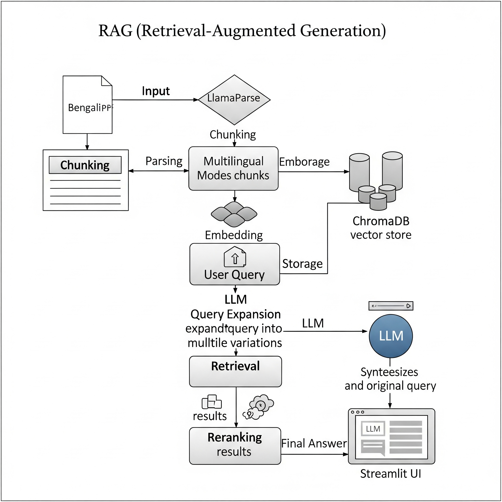
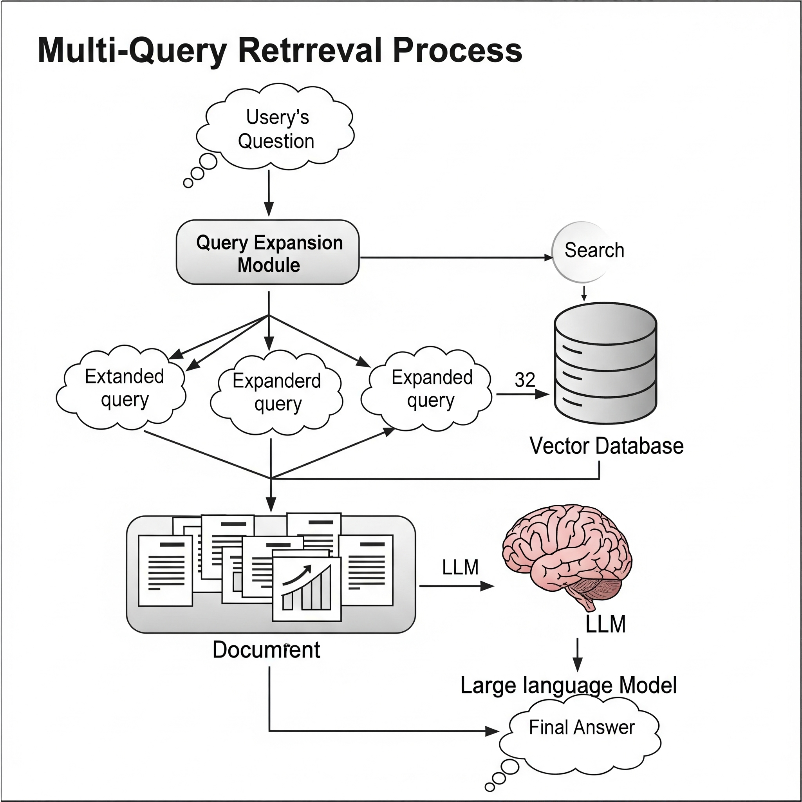

# Anwesha - A Bengali pdf RAG chatbot 📖

Anwesha is a state-of-the-art Retrieval-Augmented Generation (RAG) chatbot meticulously engineered to navigate and answer questions from Rabindranath Tagore's classic short story, "Aparichita." This project stands as a testament to the power of modern AI in understanding and interacting with complex, multilingual literary texts, offering accurate, context-aware responses in both its original Bangla and English.




-----


## 🌟 Project deployed at: https://anwesha.streamlit.app/

-----

## 🌟 SampSample queries and outputs

.png)
.png)
.png)
.png)
.png)

-----

## 🌟 About The Project

The primary motivation behind Anwesha was to tackle a significant challenge in the world of natural language processing: making literary works in non-English languages, specifically Bengali, accessible to AI-driven analysis and interaction. Standard PDF parsing tools often fail with the complexities of Bengali script and document layouts. This project was born from the desire to overcome these hurdles and build a highly accurate, robust, and user-friendly chatbot that could serve as a reliable companion for readers and researchers of Bengali literature.

### ✨ Highlighted Features

Anwesha is more than just a chatbot; it's a showcase of a sophisticated AI pipeline. Here’s a closer look at its core features:

  * **State-of-the-Art Parsing:** The system integrates **LlamaParse** in `parse_document_with_lvm` mode, powered by `anthropic-sonnet-4.0`. This isn't just standard text extraction; it's an intelligent parsing that understands the semantic structure of the PDF, preserving layouts, tables, and lists, which is crucial for the integrity of the literary text.
  * **Relevance-Focused Reranking:** To go beyond simple similarity search, Anwesha implements a reranking mechanism using **reciprocal rank fusion**. This ensures that the documents passed to the language model are not just similar but are the most relevant, leading to higher quality answers.
  * **Multi-Query Construction:** Ambiguity is a common problem in user queries. Anwesha addresses this by using a language model to generate five different versions of a user's question. This query expansion technique casts a wider net, dramatically increasing the odds of retrieving the most relevant context, even if the user's original phrasing is vague.
  * **Comprehensive Evaluation:** The system's performance isn't just a subjective claim. It was rigorously evaluated using the **Ragas** library, a specialized framework for assessing RAG pipelines on metrics like Faithfulness, Context Recall, and Factual Correctness.
  * **Seamless Deployment:** Anwesha is brought to life using **Streamlit** for a user-friendly, interactive web interface, and was initially designed with a **Flask** backend, making it both powerful and accessible.

-----

## 🔬 Features Experimented With (Not in Deployed Version)

The journey of building Anwesha involved experimenting with several advanced features. While these were not included in the final deployed version for various reasons (such as performance, complexity, or a shift in focus), they represent valuable explorations into the capabilities of modern RAG systems.

  * **CRAG (Corrective Retrieval-Augmented Generation):** The idea was to integrate web search functionality to allow the chatbot to self-correct and augment its knowledge base. This was ultimately deferred to keep the project focused on the source text and to avoid the complexities of real-time web integration.
  * **Fine-Tuned Embedding Model:** A significant amount of effort was put into experimenting with fine-tuning a state-of-the-art embedding model. While promising, the computational cost and time required for fine-tuning were substantial, and the performance of the pre-trained `intfloat/multilingual-e5-large-instruct` was already excellent for the project's scope.
  * **Hybrid Search:** The project explored combining traditional keyword-based search with semantic search. While this can be effective for certain types of queries, it added a layer of complexity to the retrieval pipeline that was not deemed necessary for the current use case, which primarily benefits from semantic understanding.
  * **LLM-Powered Dynamic Cleaning:** An automated cleaning pipeline using an LLM was developed to remove artifacts and formatting inconsistencies. While effective, it was found to be more resource-intensive than a well-crafted set of regular expressions for the specific issues present in the source document.
  * **Advanced Indexing with RAPTOR and ColBERT:** The project experimented with advanced indexing techniques like RAPTOR and ColBERT. These methods offer a more granular and sophisticated representation of the documents but require more computational resources for both indexing and retrieval, which was a trade-off that was decided against for the deployed version.
  * **Adaptive RAG:** The most ambitious experimental feature was an Adaptive RAG system that could dynamically choose the best retrieval strategy based on the query. This is a complex area of research, and while the initial explorations were insightful, a simpler, more robust pipeline was chosen for the final product.

-----

## 🛠️ Tech Stack & Architecture

Anwesha is built on a modern, powerful stack designed for building high-performance AI applications.

| Component | Technology | Role in Project |
| :--- | :--- | :--- |
| **Application Framework** | `Streamlit` | Provides the interactive, user-friendly web interface for the chatbot. |
| **Core AI Framework** | `LangChain` | The backbone of the project, used to orchestrate the entire RAG pipeline, from data ingestion to generation. |
| **LLM Inference** | `Groq` | Provides access to blazing-fast LLaMA 3 inference, powering the generation and query transformation stages. |
| **PDF Parsing**| `llama-parse`| The core tool for intelligently parsing the source PDF document, preserving its structure and content.|
| **Embedding Model**| `intfloat/multilingual-e5-large-instruct`| A powerful multilingual model used to convert text into high-dimensional vectors for semantic comparison.|
| **Vector Database** | `ChromaDB` | A lightweight and efficient open-source vector store used to store and retrieve document embeddings. |
| **Evaluation** | `Ragas` | A specialized framework used to quantitatively measure the performance and reliability of the RAG pipeline. |

-----

## ⚙️ Setup and Local Installation Guide

Follow these steps to get a local copy of Anwesha up and running on your machine.

#### 1\. Prerequisites

Ensure you have **Python (version 3.8 or higher)** and **Git** installed on your system.

#### 2\. Clone the Repository

Open your terminal and clone the project repository.

```bash
git clone <your-repository-url>
cd <your-repository-directory>
```

#### 3\. Create and Activate a Virtual Environment

It is a best practice to use a virtual environment to isolate project dependencies and avoid conflicts with other Python projects.

```bash
# Create the virtual environment
python -m venv venv

# Activate the environment
# On Windows:
venv\Scripts\activate
# On macOS/Linux:
source venv/bin/activate
```

#### 4\. Install Dependencies

Install all the necessary Python packages listed in the `requirements.txt` file.

```bash
pip install -r requirements.txt
```

#### 5\. Set Up Environment Variables

The application requires an API key from Groq to power its language model.

  * Create a file named `.env` in the root directory of the project.
  * Add your Groq API key to this file in the following format:
    ```
    GROQ_API_KEY="your_actual_groq_api_key_here"
    ```

#### 6\. Run the Application

The user interface is built with Streamlit. To start the application, run the following command in your terminal:

```bash
streamlit run app.py
```

This command will launch the application, and it should open automatically in your default web browser.

-----

## 🔧 A Deep Dive into the Technical Implementation

This section provides a detailed breakdown of the critical design choices and the reasoning behind them, showcasing the journey from problem to solution.

### 1\. The Challenge of Text Extraction

#### The Problem

The first and most significant hurdle was extracting clean, structured text from a Bengali PDF. Most standard Python libraries for PDF parsing, such as `PyPDF`, `PyMuPDF`, and `PDFPlumber`, are optimized for Latin scripts and struggled immensely with Bengali characters, often rendering them as gibberish.

#### The Journey to a Solution

Several alternatives were explored in the quest for a reliable parsing solution:

  * **Initial Success with OCR:** `UnstructuredPDFLoader`, when switched from its default `hi_res` strategy to `ocr_only`, provided a breakthrough. By leveraging the Tesseract OCR engine in its backend, it could recognize the Bengali script far better than other libraries, though it still had minor issues.
  * **Dead Ends:** Other modern tools were tested but proved unsuitable. `Mistral-ocr` did not even support the Bengali language. `Marker-pdf`, a promising tool, failed due to issues with downloading its layout models.
  * **The "Holy Grail": `LlamaParse`:** The search concluded with the discovery of `LlamaParse`. This tool was a game-changer. It was specifically engineered to handle complex, semi-structured documents, correctly identifying paragraphs, lists, and other elements with remarkable precision. Its ability to preserve the semantic layout of the source material was critical for a literary work where structure carries meaning.

### 2\. The Strategy for Document Cleaning

Once the text was extracted, it needed to be cleaned of noise like headers, footers, and formatting artifacts. An initial, more ambitious approach involved using an LLM for dynamic cleaning.

```python
// This code demonstrates the dynamic cleaning approach
text_splitter = RecursiveCharacterTextSplitter(
    chunk_size=10000, chunk_overlap=100
)

splits = text_splitter.split_documents(docs)

// Setup the LLM chain for cleaning
llm = ChatGroq(model="moonshotai/kimi-k2-instruct")

chain = (
    {"doc": lambda x: x.page_content}
    | ChatPromptTemplate.from_template("Clean and delete unnecessary stuffs from the following document without changing the conetxt:\n\n{doc}")
    | llm
    | StrOutputParser()
)

// Batch process the documents for cleaning
cleaned_documents = chain.batch(splits, {"max_concurrency": 10})
```

While this method was intelligent and effective, it was computationally expensive and quickly consumed the available Groq API limits. As a result, the project reverted to a more pragmatic approach of **manual cleaning using regular expressions (regex)** to fix specific, recurring issues.

### 3\. The Art of Chunking

**Strategy:** The project employs a `RecursiveCharacterTextSplitter`.

**Reasoning:** How you split a document into chunks is paramount for semantic retrieval. A naive strategy, like splitting every 1000 characters, could cut a sentence or a question-and-answer pair in half, destroying its meaning. The recursive splitter is far more intelligent. It attempts to split along a hierarchy of separators, prioritizing logical breaks like paragraphs (`\n\n`) first, then sentences, and so on. For a Q\&A document, this ensures that a question and its corresponding answer are highly likely to remain in the same chunk, providing the embedding model with rich, contextually complete data to work with.

### 4\. Choosing the Right Embedding Model

**Model Used:** `intfloat/multilingual-e5-large-instruct`.

**Reasoning:** The choice of embedding model was critical for the project's success. After extensive experimentation, this model was selected for three compelling reasons:

1.  **True Multilingual Power:** It demonstrated excellent performance for both **Bangla** and **English**, a non-negotiable requirement for this bilingual application. A dedicated Bengali model from Hugging Face, surprisingly, performed terribly.
2.  **Instruction-Tuned for Retrieval:** The `-instruct` variant is specifically fine-tuned to understand the *intent* behind a user's query. This makes it far more effective for retrieval tasks than general-purpose models, as it's trained to produce embeddings that are optimized for similarity search based on a query.
3.  **Top-Tier Performance:** This model is a recognized top performer on the **MTEB (Massive Text Embedding Benchmark)**, providing confidence in its ability to generate high-quality and reliable vector representations of the text.

### 5\. Handling Vague Queries with Multi-Query Retrieval

**The Problem:** Users often ask questions that are ambiguous or use different terminology than the source document. A direct similarity search might fail in these cases.

**The Solution:** Anwesha implements a **multi-query retrieval** strategy. Instead of using the user's query directly, it first passes the query to an LLM, which generates five distinct but semantically similar versions of the question.

```python
// This code generates multiple query perspectives
template = """You are an AI language model assistant. Your task is to generate five
different versions of the given user question to retrieve relevant documents from a vector
database. By generating multiple perspectives on the user question, your goal is to help
the user overcome some of the limitations of the distance-based similarity search.
Provide these alternative questions separated by newlines. Original question: {question}"""

prompt_perspectives = ChatPromptTemplate.from_template(template)

generate_queries = (
    prompt_perspectives
    | ChatGroq(model="moonshotai/kimi-k2-instruct")
    | StrOutputParser()
    | (lambda x: x.split("\n"))
)
```

Each of these five queries is then used to retrieve documents from the vector store. This approach significantly broadens the search space, increasing the likelihood of finding relevant context and making the system far more robust and forgiving of vague user input. This technique was chosen after experimenting with other methods like Rag-Fusion, Decomposition, and Step-back, as it yielded the best results for this specific use case.

-----

## ❓ Asked Questions

Here are some detailed answers to common questions about the project's implementation.

**1. What method or library did you use to extract the text, and why? Did you face any formatting challenges with the PDF content?**

  * **Method/Library:** The primary library used for text extraction was **LlamaParse**.
  * **Reasoning:** This choice was driven by a significant challenge: accurately parsing Bengali script from a PDF. Standard libraries like `PyPDF`, `PyMuPDF`, and `PDFPlumber` were ineffective, often failing to recognize Bengali characters correctly. While `UnstructuredPDFLoader` with its `ocr_only` strategy showed some promise, it wasn't perfect. LlamaParse, being specifically designed for complex, semi-structured documents, proved to be the "holy grail." It excelled at preserving the original layout, including paragraphs, lists, and tables, which is crucial for maintaining the semantic integrity of a literary text.
  * **Formatting Challenges:** Yes, significant formatting challenges were encountered. These included correctly interpreting multi-column layouts, ensuring that multiple-choice questions and their options were not disconnected, and removing repetitive headers and footers that would add noise to the dataset. An initial attempt was made to use a Groq-powered LLM to dynamically clean the text, but this proved to be too resource-intensive. Ultimately, a more pragmatic approach of manual cleaning using regular expressions was adopted to address these issues.

**2. What chunking strategy did you choose (e.g. paragraph-based, sentence-based, character limit)? Why do you think it works well for semantic retrieval?**

  * **Strategy:** The project uses a **`RecursiveCharacterTextSplitter`**.
  * **Reasoning:** This strategy is highly effective for semantic retrieval because it prioritizes keeping contextually related information together. For a Q\&A document, it's crucial that a question and its corresponding answer, or a full paragraph explaining a concept, remain in the same chunk. A naive character-limit chunking could easily split these related parts, making it impossible for the retriever to find the complete information needed. By maintaining these logical blocks, we provide the embedding model with richer, more coherent data to encode, which leads to more accurate and relevant search results.

**3. What embedding model did you use? Why did you choose it? How does it capture the meaning of the text?**

  * **Model:** The embedding model used is **`intfloat/multilingual-e5-large-instruct`**.
  * **Reasoning:** This model was selected for three key reasons:
    1.  **Multilingual Capability:** It provides excellent performance for both **Bangla** and **English**, a core requirement for this application.
    2.  **Instruction-Tuned:** The `-instruct` variant is specifically fine-tuned to understand the intent behind queries, making it superior for retrieval tasks compared to general-purpose embedding models.
    3.  **High Performance:** It is a top-tier model on the MTEB (Massive Text Embedding Benchmark), ensuring high-quality and reliable vector representations.
  * **How it Captures Meaning:** The model converts text into high-dimensional vectors (embeddings) using a deep neural network. It's trained to place text with similar meanings close together in the vector space. This allows us to find relevant documents by searching for vectors that are "nearest" to the query's vector, effectively searching by meaning rather than just keywords.

**4. How are you comparing the query with your stored chunks? Why did you choose this similarity method and storage setup?**

  * **Storage and Comparison:** The document chunks are stored as embeddings in a **ChromaDB** vector store. When a user submits a query, it is converted into a vector using the same embedding model. This query vector is then compared against all the stored document vectors using a **cosine similarity** search to find the most relevant chunks. Additionally, **reciprocal rank fusion** is used to rerank the results for better accuracy.
  * **Reasoning:**
      * **ChromaDB** was chosen because it's a lightweight, open-source, and easy-to-use vector database that integrates seamlessly with LangChain, making it ideal for development and deployment.
      * **Cosine Similarity** is the standard for this task because it effectively measures the semantic similarity between two vectors by calculating the angle between them, regardless of their magnitude. This makes it excellent for comparing the meaning of texts of different lengths.

**5. How do you ensure that the question and the document chunks are compared meaningfully? What would happen if the query is vague or missing context?**

  * **Meaningful Comparison:** Consistency is key. By using the **exact same embedding model** (`multilingual-e5-large-instruct`) for both indexing the documents and processing user queries, we ensure that both are mapped into the same semantic vector space, allowing for a fair and meaningful comparison.
  * **Handling Vague Queries:** The system uses a **multi-query retrieval** strategy. Instead of just using the user's original query, it first passes the query to an LLM to generate five different versions of it. This query expansion technique broadens the search, increasing the likelihood of finding relevant documents even if the original phrasing was ambiguous or used different terminology than the source text. This was found to be the most effective query transformation technique after experimenting with others like Rag-Fusion, Decomposition, and Step-back.

**6. Do the results seem relevant? If not, what might improve them (e.g. better chunking, better embedding model, larger document)?**

  * **Relevance:** Yes, the results are highly relevant. This is not just a subjective assessment; the application includes a built-in evaluation framework using the **`ragas`** library. This allows for quantitative measurement of performance with metrics like **Faithfulness** (is the answer based on the context?), **Context Recall** (was the right context found?), and **Factual Correctness**.
  * **Potential Improvements:**
      * **Better Embedding Model:** Using a more advanced model like `gemini-embedding-001` and fine-tuning it on the specific domain could significantly boost performance.
      * **Advanced Indexing:** Implementing techniques like **RAPTOR** and **ColBERT** could lead to more highly accurate and granular indexing and retrieval.
      * **Adaptive RAG:** The ultimate improvement would be to implement an Adaptive RAG system that can learn from its interactions and dynamically adapt its retrieval strategy to best suit the user's query.

-----

## 📊 A Note on Evaluation

The quality of Anwesha is not an afterthought; it was a core part of the development process. The system was rigorously evaluated using the `ragas` library, focusing on three key metrics:

  * **Faithfulness:** This measures whether the generated answer is factually grounded in the retrieved context. A high score means the model is not "hallucinating" or inventing information.
  * **Context Recall:** This metric assesses whether the retrieval system successfully found all the necessary information from the source text required to comprehensively answer the question.
  * **Factual Correctness:** This compares the generated answer against a ground-truth (a manually verified correct answer) to determine its factual accuracy.

**Important:** The evaluation code was **intentionally removed** from the final `app.py` script for deployment. This was a deliberate choice to create a lighter, faster application with fewer dependencies, focusing the user experience solely on the chatbot's functionality. The detailed evaluation code and its results are preserved in the development notebooks (`anwesha_version_0_final_version.ipynb`) in the project repository for reference.

-----